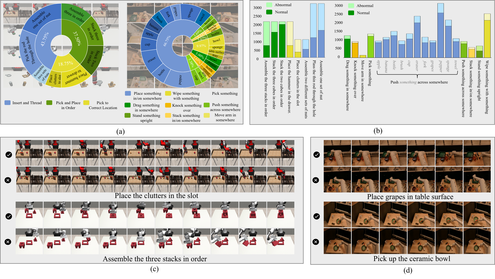

# RobAVA
All about RobAVA: data, models, and more... keep starring and stay tuned!


This is the official repository for <br/>***[ICCV2025] 'RobAVA: A Large-scale Dataset and Baseline Towards Video based Robotic Arm Action Understanding***
<br/>**Baoli Sun, Ning Wang, Xinzhu Ma, Anqi Zou, Yihang Lu, Chuixuan Fan, Zhihui Wang*, Kun Lu, Zhiyong Wang**
<br/>*Dalian University of Technology, Dalian, The Chinese University of Hong Kong, The University of Sydney*


<h2> <p align="center"> RobAVA Dataset </p> </h2>  



### Download

- [Google Drive](https://drive.google.com/xxx)
- [Baidu Yun](https://pan.baidu.com/xxx)

### Data Preparation

We provide our labels in `data_list`.

After all the videos were downloaded, prepare the csv files for training, validation, and testing set as `train.csv`, `val.csv`, `test.csv` in `data_list/robava_s`. The format of the csv file is:

```
path_to_video_1,action_label_1,abnormal_label
path_to_video_2,action_label_2,abnormal_label
path_to_video_3,action_label_3,abnormal_label
...
path_to_video_N,action_label_N,abnormal_label
```


<h2> <p align="center"> AGPT-Net </p> </h2> 


### Installation

- Python >= 3.7
- Numpy
- PyTorch >= 1.9 (Acceleration for 3D depth-wise convolution)
- [fvcore](https://github.com/facebookresearch/fvcore/): `pip install 'git+https://github.com/facebookresearch/fvcore'`
- [torchvision](https://github.com/pytorch/vision/) that matches the PyTorch installation.
  You can install them together at [pytorch.org](https://pytorch.org) to make sure of this.
- simplejson: `pip install simplejson`
- GCC >= 4.9
- PyAV: `conda install av -c conda-forge`
- ffmpeg (4.0 is prefereed, will be installed along with PyAV)
- PyYaml: (will be installed along with fvcore)
- tqdm: (will be installed along with fvcore)
- iopath: `pip install -U iopath` or `conda install -c iopath iopath`
- psutil: `pip install psutil`
- OpenCV: `pip install opencv-python`
- torchvision: `pip install torchvision` or `conda install torchvision -c pytorch`
- tensorboard: `pip install tensorboard`
- moviepy: (optional, for visualizing video on tensorboard) `conda install -c conda-forge moviepy` or `pip install moviepy`
- PyTorchVideo: `pip install pytorchvideo`
- Decord: `pip install decord`

After having the above dependencies, run:
```
python setup.py build develop
```


### Training

Our models are based on pretrained ViTs, and we use [CLIP](https://github.com/openai/CLIP) pretrained models by default:
- Follow `extract_clip` to extract visual encoder from CLIP.
- Change `MODEL_PATH` in `slowfast/models/agptnet_model.py`.

For training, you can simply run the training scripts in `exp` as follows:
```shell
bash ./exp/robava_s/k400_b16_f8x224/run.sh
```


### Testing
For testing, you can simply run the training scripts in `exp` as follows:

```shell
bash ./exp/robava_s/k400_b16_f8x224/test.sh
```


### Any Question

If you have any other questions about the dataset and code, please email [Baoli Sun](baoli@mail.dlut.edu.cn) or [Ning Wang](nwang@dlut.edu.cn).


## Citation

If this work has been helpful to you, please feel free to cite our paper!

```
@inproceedings{sun2025robava,
  title={RobAVA: A Large-scale Dataset and Baseline Towards Video based Robotic Arm Action Understanding},
  author={Baoli Sun, Ning Wang, Xinzhu Ma, Anqi Zou, Yihang Lu, Chuixuan Fan, Zhihui Wang, Kun Lu, Zhiyong Wang},
  booktitle={Proceedings of the IEEE/CVF International Conference on Computer Vision},
  year={2025}
}
```
